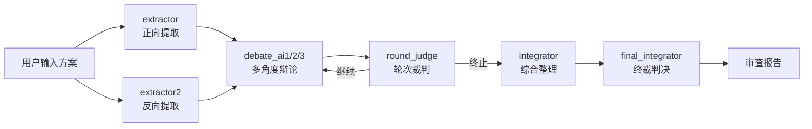

<div align="center">

# 瀚海 AI 审查系统 · HankAI Review

**多 Agent 对抗辩论式 AI 审查引擎**

> 「假设有罪 + 对抗出真知」—— 8 角色辩论，系统化暴露方案盲区

[](https://opensource.org/licenses/MIT)
[](https://www.typescriptlang.org/)
[](https://react.dev/)
[](https://vite.dev/)
[](https://www.electronjs.org/)
[](https://tailwindcss.com/)
[](https://github.com/Hank-create519/HankAI-Review/pulls)

</div>

---

<p align="center">
  <a href="#-核心理念">理念</a> ·
  <a href="#-审查流程">流程</a> ·
  <a href="#-架构">架构</a> ·
  <a href="#-安全机制">安全</a> ·
  <a href="#-快速开始">快速开始</a> ·
  <a href="#-技术栈">技术栈</a> ·
  <a href="#-项目结构">结构</a>
</p>

---

## 核心理念

每个方案在被证明可靠之前，默认存在漏洞。系统不负责「审批」方案，而是通过多视角碰撞暴露用户自身难以发现的盲区。

> 审查流水线：**提取 → 反向提取 → 多角度辩论 → 汇总裁决**

---

## 审查流程

### 四层八角色体系

| 层级 | 角色 | 标识 | 职责 |
|:---:|------|------|------|
| 第一层 | 提取者 | `extractor` | 正向提取方案要点，构建理解基线 |
| 第一层 | 反向提取者 | `extractor2` | 反向审视，寻找遗漏与矛盾 |
| 第二层 | 辩论 Agent ×3 | `debate_ai1/2/3` | 多角度攻防辩论，各自独立立场 |
| 第三层 | 综合者 | `integrator` | 整合辩论成果，提炼关键分歧 |
| 第三层 | 终裁者 | `final_integrator` | 终局裁决，输出审查报告 |
| 第四层 | 轮次裁判 | `round_judge` | 控制辩论轮次质量，决定是否继续 |

### 审查管线



---

## 架构

```
┌─────────────────────────────────────────────────┐
│                   Electron 桌面壳                  │
│  ┌───────────────────────────────────────────┐  │
│               React 19 + Vite 8               │  │
│  ┌──────────┐ ┌──────────┐ ┌──────────────┐  │  │
│  │ 审查引擎  │ │ 安全守卫  │ │  工具注册表   │  │  │
│  │engine.ts  │ │safetyGuard│ │toolRegistry  │  │  │
│  │  792 行   │ │  291 行   │ │   130+ 行    │  │  │
│  └──────────┘ └──────────┘ └──────────────┘  │  │
│  ┌──────────────────────────────────────────┐  │  │
│  │         审查会话管理 · reviewStore         │  │  │
│  │    pause / resume / stop（类比播放器）     │  │  │
│  └──────────────────────────────────────────┘  │  │
│  ┌───────────────┐  ┌───────────────────────┐  │  │
│  │  SQL.js 本地DB │  │  多协议 LLM API 适配   │  │  │
│  │ database.ts    │  │  OpenAI/Anthropic/    │  │  │
│  │               │  │  Google/DeepSeek      │  │  │
│  └───────────────┘  └───────────────────────┘  │  │
│  └───────────────────────────────────────────┘  │
└─────────────────────────────────────────────────┘
```

---

## 安全机制

五层纵深防御：

| 层级 | 名称 | 策略 |
|:---:|------|------|
| L1 | 工具白名单 | 按 `roleKey` 控制可用工具（extractor→web_search，debate→web_search+web_fetch） |
| L2 | 速率限制 | 每角色最大调用数限制，防无限辩论循环 |
| L3 | 参数校验 | 文件路径遍历防护、输入类型检查 |
| L4 | 沙箱执行 | Python 超时控制（30s）、进程隔离 |
| L5 | 结果清洗 | 输出脱敏，移除敏感路径信息 |

**工具调用循环**：`MAX_ITERATIONS=15`，`WARN_AT=10` 轮时发出警告，最后一轮强制终止并汇总。

---

## 快速开始

```bash
git clone https://github.com/Hank-create519/HankAI-Review.git
cd HankAI-Review

# 安装依赖
npm install

# Web 模式开发
npm run dev

# Electron 桌面端开发
npm run electron:dev

# 构建桌面应用
npm run electron:build
```

---

## 技术栈

| 类别 | 技术 |
|------|------|
| 语言 | TypeScript 6.0 |
| 框架 | React 19 + React Router 7 |
| 构建 | Vite 8 |
| CSS | Tailwind CSS 4.3 + Framer Motion 12 |
| 状态管理 | Zustand 5 |
| 本地存储 | SQL.js |
| 桌面壳 | Electron 42 |
| 国际化 | i18next 26 |
| WebGL 背景 | OGL（粒子系统 / 星场特效） |

---

## 项目结构

```
源码/
├── config/
│   ├── package.json          # 项目配置 & 依赖
│   ├── electron-main.cjs     # Electron 主进程
│   └── preload.cjs           # 预加载脚本
├── src/
│   ├── sdk/
│   │   ├── engine.ts         # 审查引擎 (792行)
│   │   ├── react.tsx         # React 绑定
│   │   └── components.tsx    # SDK 组件
│   ├── skills/
│   │   ├── safetyGuard.ts    # 五层安全 (291行)
│   │   ├── toolRegistry.ts   # 工具注册表
│   │   ├── skillManager.ts   # 技能管理
│   │   └── githubImporter.ts # GitHub Skill 导入
│   ├── store/
│   │   └── reviewStore.ts    # 审查会话状态管理
│   ├── utils/
│   │   ├── llmApi.ts         # 多协议 LLM 适配
│   │   └── scheduler.ts      # 任务调度器
│   ├── db/
│   │   ├── database.ts       # SQL.js 封装
│   │   └── schema.ts         # 表结构
│   ├── hooks/                # useDB / useTheme / useSpotlight
│   ├── pages/                # Home / Config / TaskNew / TaskMonitor / History / About
│   ├── components/           # Sidebar / TopBar / Spotlight / StarField / MouseGlow
│   ├── types/                # TypeScript 类型定义
│   └── i18n/                 # 国际化 (中/英)
├── AI_CONSTITUTION.md        # AI 宪法（Agent 行为约束）
└── temp/                     # 构建中间产物
```

---

## 特色

- **Spotlight 渐进光效**：Canvas 2D 径向渐变真发光，拒绝 CSS 伪元素堆叠
- **星场 / 点阵背景**：WebGL 粒子系统，低 GPU 占用
- **Electron 桌面端**：`asar` 打包，无外部服务依赖
- **暂停 / 恢复 / 终止**：审查过程支持播放器式控制
- **国际化**：中英文切换，无硬编码文案
- **离线优先**：SQL.js 本地数据库，无需联网即可工作

---

## License

MIT © 2026 Hank个人工作室

---

<p align="center">
  <sub>Built with ❤️ by <a href="https://github.com/Hank-create519">Hank-create519</a></sub>
</p>
